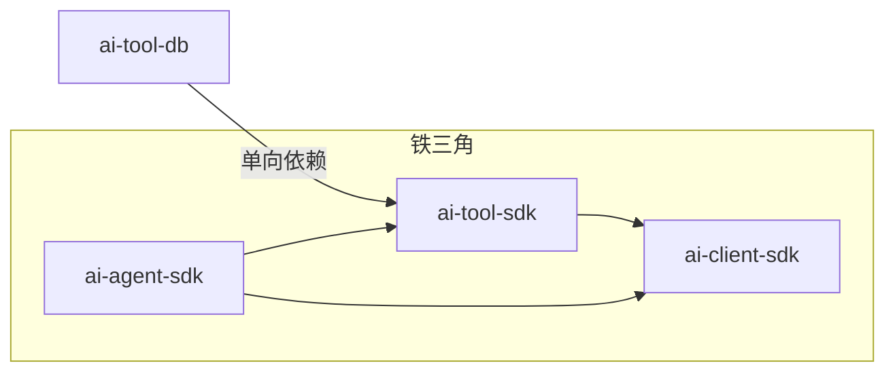
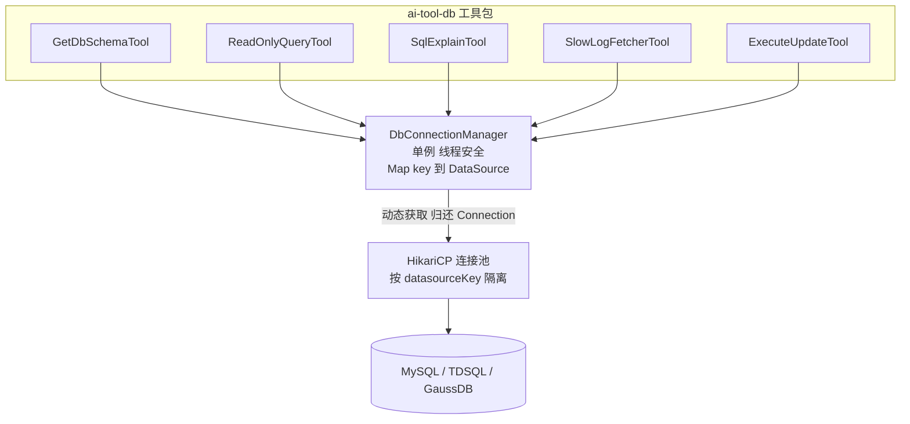

# ai-tool-db 领域工具包设计计划

> 更新时间：2026-09-01 | 状态：规划中（Plan）| 定位：铁三角「中层领域工具扩展包」

---

## 一、定位与目标

`ai-tool-db` 是铁三角架构中的**中层领域工具扩展包**，与 `ai-tool-rag`、`ai-tool-k8s` 同层。它基于 `ai-tool-sdk` 的 `@Tool` / `AgentTool` 契约实现一组**数据库原子诊断与受控变更工具**，服务于慢 SQL 分析、执行计划诊断、表结构探查、只读查询、受控写操作等 DBA 场景。

> 命名约定：核心基础设施带 `-sdk` 后缀（`ai-client-sdk` / `ai-tool-sdk` / `ai-agent-sdk`），扩展工具包**不带 `-sdk` 后缀**（`ai-tool-db` / `ai-tool-rag` / `ai-tool-k8s`），以明确区分"基础设施 SDK"与"工具集合扩展包"。

### 1.1 核心诉求

| 诉求 | 说明 |
|---|---|
| **可拔插（Pluggable）** | 独立 Maven 模块，应用层按需引入；不引入则零依赖、零副作用，且不会被其他工具包传递依赖 |
| **通用（General）** | 不绑定单一数据库厂商，通过 `DbDialect` 方言抽象支持 MySQL / TDSQL / GaussDB；连接管理支持外部注入与工具包托管双模式 |
| **安全控制第一（Security-First）** | "安全控制第一，Schema 驱动思考，受控 SQL 执行"——JSqlParser 语法级校验、无条件 `WHERE` 阻断、结果集 Token 防爆 |
| **连接池自治（Pool Self-Managed）** | 针对 Agent"思考长、慢 SQL 多、串行查库"特性，动态多数据源 + Agent 专用参数调优 + Statement 级强杀 + LRU/TTL 驱逐 |
| **原子能力（Atomic）** | 只提供 5 个原子工具，不实现场景编排（场景编排属于上层场景 SDK） |

### 1.2 依赖规则（铁律）



- `ai-tool-db` **只单向依赖 `ai-tool-sdk`**，绝不反向、绝不依赖 `ai-agent-sdk`。
- **JDBC / 连接池 / SQL 解析依赖全部放在 `ai-tool-db` 内**（`ai-tool-sdk` 铁律禁止引入 JDBC 数据源依赖）。
- `ai-tool-db` 只组合/实现 `@Tool`，不实现场景 Prompt 与 ReAct 编排。
- HITL 审批依赖 `ai-tool-sdk` 的 `@Tool(requiresApproval)` 契约 + `ai-agent-sdk` 的挂起/恢复机制（运行时协作，非编译期依赖）。

---

## 二、可拔插架构设计

### 2.1 Maven 模块

`ai-tool-db` 作为独立子模块，**默认不加入父 POM 的 `<modules>` 聚合构建**（或加入但保持轻量），应用层按需在自身 `pom.xml` 中显式声明：

```xml
<dependency>
    <groupId>com.realapex</groupId>
    <artifactId>ai-tool-db</artifactId>
    <version>1.0.0-SNAPSHOT</version>
</dependency>
```

关键点：
- `ai-tool-db` 的 `ai-tool-sdk` 依赖声明为 **`compile` 作用域**（工具契约必需），但 `ai-tool-db` 自身绝不反向被 `ai-tool-sdk` / `ai-agent-sdk` 引用。
- `ai-tool-db` 内部依赖 `HikariCP` + `JSqlParser`，二者**只存在于 `ai-tool-db` 的传递依赖树**，不会污染 `ai-tool-sdk` / `ai-agent-sdk`。
- 应用层不引入 `ai-tool-db` 时，编译产物中不存在任何 JDBC / 数据库相关类，满足"无数据库场景零负担"。

### 2.2 依赖树对比

| 场景 | 引入依赖 | 效果 |
|---|---|---|
| 纯文件/命令场景 | 仅 `ai-tool-sdk` | 无 JDBC / 连接池 / SQL 解析字节码，包体最轻 |
| 数据库分析场景 | `ai-tool-sdk` + `ai-tool-db` | 获得 5 个数据库原子工具 + 动态连接池管理 + JSqlParser 安全卡口 |

---

## 三、连接管理设计（连接池自治核心）

> Agent 数据库任务与传统 Web 请求差异巨大：传统请求平稳且生命周期短（毫秒级），而 Agent 思考时间长、可能生成慢 SQL、也可能在一个 Task 中频繁查库。因此连接池**不能简单全局单例 HikariDataSource**，需从「隔离策略、生命周期、超时防泄露」三维度设计。

### 3.1 动态多数据源管理器 `DbConnectionManager`



`DbConnectionManager` 是连接管理的**唯一入口**，工具不直接触碰 `Connection` 获取逻辑，统一通过它解析数据源。核心职责：数据源注册/解析、连接借还、TTL/LRU 驱逐、优雅关闭。

```java
public final class DbConnectionManager {

    /** 模式 A：应用层注入的外部 DataSource（生命周期不归本工具包管理） */
    private final DataSource externalDataSource;

    /** 模式 B：工具包托管的动态数据源缓存（key -> 托管数据源 + 最近访问时间） */
    private final ConcurrentHashMap<String, ManagedDataSource> managedPool = new ConcurrentHashMap<>();

    /** TTL 驱逐调度器（单线程 daemon） */
    private final ScheduledExecutorService evictionExecutor;

    /** 按 key 解析数据源：优先 managedPool，其次 externalDataSource */
    public DataSource resolve(String datasourceKey) { /* ... */ }

    /** 注册工具包托管数据源（模式 B），内部构建 HikariCP */
    public void register(String key, DbToolConfig config) { /* ... */ }

    /** 显式注销并关闭指定数据源 */
    public void evict(String key) { /* ... */ }

    /** 优雅关闭全部托管连接池 */
    public void close() { /* ... */ }
}
```

### 3.2 双模式接入：外部注入 vs 工具包托管

| 模式 | 场景 | 生命周期 | 适用 |
|---|---|---|---|
| **模式 A（外部注入，推荐）** | 应用已有 Spring Boot + HikariCP/Druid DataSource | 交给 Spring 管理，`ai-tool-db` 不创建、不关闭 | 生产主库、稳定连接 |
| **模式 B（工具包托管）** | Agent 运行时动态连临时/测试库 | `ai-tool-db` 自动建池 + TTL 超时销毁 | 多库切换、临时诊断 |

```java
// 模式 A：直接复用已有数据源
List<AgentTool<?, ?>> tools = DbToolFactory.createDbTools(myExistingDataSource, new MySqlDialect());

// 模式 B：动态注册让 ai-tool-db 托管连接池
DbConnectionManager.register("test-db", DbToolConfig.builder()
        .jdbcUrl("jdbc:mysql://localhost:3306/demo")
        .username("root")
        .password("secret")
        .build());
```

### 3.3 Agent 专用连接池参数调优

Agent 调工具并发特征为「单任务串行思考或有限并发」，连接池参数**不能照搬常规 Web 高并发配置**，应偏向「小池子、快回收、强超时」。

| 参数 | 推荐值 | Agent 场景理由 |
|---|---|---|
| `maximumPoolSize` | **5 ~ 10** | Agent 少并发调用工具，防止一下打爆数据库连接数（多用户共享时可上调） |
| `minimumIdle` | **1 ~ 2** | 保持极低空闲，节省数据库资源 |
| `connectionTimeout` | **5,000 ms** | 获取连接超 5s 直接报错，快速失败给 Agent 触发自愈/重试，而非死等 |
| `idleTimeout` | **60,000 ms** | 空闲 1 分钟回收，Agent 思考/停顿可能长达数分钟 |
| `maxLifetime` | **10 ~ 30 min** | 避免防火墙/网关断开长连接（GaussDB/TDSQL 云上尤其关键） |
| `keepaliveTime` | 0（默认）/ TDSQL 建议 30s | TDSQL 网关空闲断开敏感，需主动保活 |
| `connectionTestQuery` | `SELECT 1` | 探活校验 |

### 3.4 Statement 级强杀与防泄露

连接池只能解决「连接的借与还」，解决不了「Agent 生成慢 SQL / 笛卡尔积导致连接卡死阻塞」。因此统一封装 `JdbcExecutor`，强制叠加 Statement 超时与行数限制：

```java
public final class JdbcExecutor {

    public <T> T query(DataSource ds, DbToolConfig config, String sql,
                       SqlResultMapper<T> mapper) {
        try (Connection conn = ds.getConnection();
             PreparedStatement stmt = conn.prepareStatement(sql)) {

            // 1. 语句级超时（默认 10s），防止慢 SQL 拖垮连接池
            stmt.setQueryTimeout(config.getQueryTimeoutSeconds());

            // 2. 游标读取 + maxRows 保护内存，防止 OOM
            stmt.setMaxRows(config.getMaxRows());

            try (ResultSet rs = stmt.executeQuery()) {
                return mapper.map(rs);
            }
        } // try-with-resources 自动 close，无条件归还连接给池子
    }
}
```

**防泄露铁律**：
- 统一通过 `try-with-resources` 获取/释放 `Connection`，**绝不**把 `Connection` 裸露给外部或保存在 `SkillContext` 中。
- 写操作拿连接后开启手动提交，异常时 `Connection.rollback()`，避免未提交事务卡死锁表。

### 3.5 多租户隔离与 LRU/TTL 动态驱逐

Agent 可帮用户连 A 库、过会儿连 B 库，会动态创建大量 DataSource。若不清理，内存中会挂成百上千个 `HikariDataSource` 导致连接数与 OOM 爆炸。

**解决方案**：带 **TTL 驱逐**的动态缓存管理器（自研轻量实现，避免引入 Guava/Caffeine 额外依赖）：

```java
private static final class ManagedDataSource {
    private final HikariDataSource dataSource;
    private final AtomicLong lastAccessNanos = new AtomicLong(System.nanoTime());
    // 访问时刷新 lastAccessNanos
}

// 单线程调度器周期扫描：超过 idleTtl（默认 30 分钟）未访问 → hikariDs.close() 并移除
```

> 备选：若未来需要更丰富的驱逐语义（LRU 容量上限、软引用），可替换为 Caffeine，但保持对外接口不变。当前版本采用 `ConcurrentHashMap + ScheduledExecutorService` 零额外依赖实现，契合工程最小依赖原则。

### 3.6 数据库方言抽象 `DbDialect`

不同数据库在 `EXPLAIN` 语法、慢查询视图、Schema 系统表、`LIMIT` 改写、标识符转义上存在差异，抽象为策略接口：

```java
public interface DbDialect {

    /** 方言名称（mysql / tdsql / gaussdb） */
    String name();

    /** 生成执行计划查询语句（如 MySQL: EXPLAIN {sql}） */
    String buildExplainSql(String sql);

    /** 生成慢查询抓取 SQL（如 MySQL: SELECT * FROM mysql.slow_log WHERE ...） */
    String buildSlowLogQuery(SlowLogFilter filter);

    /** 生成表结构提取 SQL（information_schema / pg_catalog） */
    String buildExtractSchemaSql(String schema, String table);

    /** 为查询 SQL 强制注入/改写 LIMIT 限制（防全表扫描） */
    String applyLimit(String sql, int maxRows);

    /** 校验 SQL 是否包含危险关键字或缺失 WHERE 条件（方言级增强，见 TDSQL 分片键校验） */
    void validateSqlSafety(String sql);

    /** 标识符转义（MySQL: `col`，GaussDB/openGauss: "col"） */
    String quoteIdentifier(String identifier);
}
```

方言实现通过 **`DbDialectFactory`** 自动探测或按配置创建：

| 方言 | 说明 |
|---|---|
| `MySqlDialect` | 标准 MySQL 语义，`information_schema` + 反引号转义 + `LIMIT N` |
| `TdsqlDialect` | **继承 `MySqlDialect`**，兼容 MySQL 协议；`validateSqlSafety` 增强分片键校验（变更操作需带 Shard Key，防广播全分片） |
| `GaussDbDialect` | 基于 openGauss/PostgreSQL 语义，`pg_catalog` / `information_schema`，双引号转义 + `LIMIT N` / `FETCH FIRST N ROWS ONLY` |

### 3.7 方言连接特殊注意点

| 数据库 | 连接池注意点 |
|---|---|
| **TDSQL** | 前置 TProxy 网关对长连接空闲断开敏感，`idleTimeout` 必须小于 TProxy 超时（建议 1-2 min）并开启 `keepaliveTime`；校验 SQL `SELECT 1` |
| **GaussDB** | JDBC 驱动（`org.opengauss.Driver` / `com.huawei.gaussdb.jdbc.Driver`）建连较重；探活用 `connectionTestQuery = "SELECT 1"` 或 JDBC4 `isValid()`；失败事务归还前必须 `rollback()`，否则复用时报 `current transaction is aborted` |

---

## 四、五个原子工具定义

> 工具命名统一为 `snake_case`，与 `ai-tool-sdk` 基础工具命名风格一致。

### 4.1 Schema 探查器 `GetDbSchemaTool`

| 项 | 内容 |
|---|---|
| 工具名 | `get_db_schema` |
| 职责 | 获取数据库表名、列名、字段类型、索引、主外键及表注释 |
| 入参 | `SchemaRequest`（schema、table；table 为空时返回库内表清单） |
| 出参 | 表结构摘要（字段列表 + 索引信息 + 表注释） |
| 方言差异 | MySQL `information_schema.COLUMNS` / `SHOW CREATE TABLE`；GaussDB `pg_catalog` / `information_schema` |
| 缓存 | 用 `ConcurrentHashMap` 缓存 Schema 结果；大库表数量限制截断 |
| 安全 | `readOnly = true` |

### 4.2 只读查询执行器 `ReadOnlyQueryTool`

| 项 | 内容 |
|---|---|
| 工具名 | `readonly_query` |
| 职责 | 执行只读 SELECT / SHOW 查询（用于探查数据、验证假设） |
| 入参 | `QueryRequest`（sql、maxRows，maxRows 受全局上限约束） |
| 出参 | 查询结果集（自动截断 + 强制 LIMIT 保护） |
| 方言差异 | 方言 `applyLimit` 负责强制注入 `LIMIT` / `FETCH FIRST` |
| 安全 | `readOnly = true`，**JSqlParser 语法级只读校验** + Statement 级超时强杀 + 结果集 Token 截断 |

### 4.3 执行计划分析器 `SqlExplainTool`

| 项 | 内容 |
|---|---|
| 工具名 | `explain_sql` |
| 职责 | 获取指定 SQL 的 EXPLAIN 执行计划，协助慢 SQL 诊断 |
| 入参 | `ExplainRequest`（sql） |
| 出参 | 执行计划（type、possible_keys、key、rows、Extra 等） |
| 方言差异 | MySQL `EXPLAIN {sql}`；GaussDB `EXPLAIN (ANALYZE, COSTS) {sql}` 输出列不同，需方言归一化 |
| 安全 | `readOnly = true`，仅允许 `EXPLAIN` 前缀，隔离生产查询 |

### 4.4 慢查询抓取器 `SlowLogFetcherTool`

| 项 | 内容 |
|---|---|
| 工具名 | `fetch_slow_logs` |
| 职责 | 按时间窗/阈值/关键字抓取慢查询日志 |
| 入参 | `SlowLogFilter`（startTime、endTime、minDurationMs、keyword、limit） |
| 出参 | 慢查询列表（含 SQL 文本、耗时、扫描行数、执行时间） |
| 方言差异 | MySQL `mysql.slow_log` / `performance_schema`；TDSQL 分片慢日志视图；GaussDB `dbe_perf` 慢 SQL 视图 |
| 安全 | `readOnly = true` |

### 4.5 受控写操作执行器 `ExecuteUpdateTool`

| 项 | 内容 |
|---|---|
| 工具名 | `execute_update` |
| 职责 | 执行数据变更（`INSERT` / `UPDATE` / `DELETE`），受安全卡口 + HITL 双重约束 |
| 入参 | `UpdateRequest`（sql） |
| 出参 | 影响行数、执行结果 |
| 安全 | **`requiresApproval = true`（触发 HITL 审批）**；强制 `WHERE` 条件校验；影响行数上限卡口；高危 DDL/DCL 绝对拦截 |

> 典型 ReAct 路径：`get_db_schema` 探查结构 → `readonly_query` 验证假设 → `explain_sql` 诊断慢 SQL → `execute_update` 受控变更（HITL 审批）→ `fetch_slow_logs` 复盘。

---

## 五、安全设计（安全控制第一）

### 5.1 只读 SQL 校验拦截器 `ReadOnlySqlInterceptor`

新增拦截器（实现 `ai-tool-sdk` 的 `ToolSecurityInterceptor`），采用 **JSqlParser 语法级解析**，而非简单字符串前缀匹配，从根本上杜绝拼接/注释/大小写绕过：

```java
// priority 设为 5（先于 DangerousCommandFilter 的 20 执行）
public class ReadOnlySqlInterceptor implements ToolSecurityInterceptor {

    @Override
    public void before(String toolName, Object request) {
        // 1. 提取 SQL 字符串
        // 2. 用 JSqlParser 解析为 AST（Statements）
        // 3. 校验：单条语句 且 Statement 类型 ∈ { Select, Explain, ShowStatement, Describe }
        // 4. 拦截：Insert / Update / Delete / Drop / Alter / Truncate / Create /
        //         Grant / Revoke / Call / Exec / 多语句（; 分隔）等，抛 SecurityException
    }

    @Override
    public int priority() { return 5; }
}
```

**语法级解析的优势**：
- 解析 AST 识别语句类型，无法通过 `SELECT` 前缀后拼接恶意语句绕过；
- 天然拦截多语句（`;` 分隔）与注释注入（`--`、`/* */`）；
- 对 `WITH ... SELECT`（CTE）等合法只读复杂查询正确放行；
- 识别并放行 `EXPLAIN` / `SHOW` / `DESCRIBE` 等方言只读语句。

**允许的只读语句类型**（Statement AST 白名单）：`Select`（含 `WITH` CTE）、`Explain`、`ShowStatement`、`Describe`。

**拦截的写/危险语句类型**（黑名单）：`Insert`、`Update`、`Delete`、`Drop`、`Alter`、`Truncate`、`Create`、`Grant`、`Revoke`、`Call`、`Exec`、`Merge`、`Set`（含变量赋值）、多语句。

### 5.2 写操作安全卡口 `SqlSafetyChecker`

针对 `execute_update` 工具，在 `ReadOnlySqlInterceptor` 之外叠加写操作专属卡口：

| 卡口 | 规则 | 处理 |
|---|---|---|
| **高危 DDL/DCL 绝对拦截** | `DROP DATABASE` / `DROP TABLE` / `TRUNCATE` / `GRANT` / `REVOKE` 等 | 直接阻断，返回 `ToolResult.fail`（除非显式开启专家模式） |
| **无条件 `WHERE` 阻断** | `UPDATE` / `DELETE` 无 `WHERE` 条件 | 阻断，返回 `ToolResult.fail("UPDATE/DELETE 必须带条件，禁止全表更新/删除")` |
| **影响行数上限卡口** | 变更影响行数超过 `maxAffectedRows`（默认 500） | 阻断并提示缩小变更范围 |
| **方言级安全增强** | `validateSqlSafety` 扩展点 | TDSQL 校验分片键，防止广播全分片 |

```java
public class SqlSafetyChecker {
    /** 基于 JSqlParser AST 做写操作安全校验，返回校验结果或抛异常 */
    public void validateUpdate(UpdateRequest request, DbToolConfig config) {
        // 1. 解析 AST，识别 DML 类型（Insert/Update/Delete）
        // 2. 高危 DDL/DCL 绝对拦截
        // 3. Update/Delete 无条件 WHERE → 阻断
        // 4. 委托 dialect.validateSqlSafety 做方言增强（如 TDSQL 分片键）
    }
}
```

### 5.3 HITL 人工确认卡口

- `ExecuteUpdateTool` 声明 `@Tool(requiresApproval = true)`，Agent 拟执行变更 SQL 时，配合 `ai-agent-sdk` 挂起任务，将待执行 SQL 渲染给开发者/运维人员审批，通过后继续执行。
- 其余 4 个只读工具 `requiresApproval = false`。
- HITL 机制复用已实现的 `AgentSuspendedException` + `AgentRunner.resume` + `ApprovalResult`，无需在 `ai-tool-db` 内重复实现。

### 5.4 结果集 Token 防爆

- 无论大模型写的 SQL `LIMIT` 是多少，`ReadOnlyQueryTool` 强制在 `DbToolConfig.maxRows`（默认 100）内限定最大返回行数。
- 查询结果字符数超限时，复用 `ai-tool-sdk` 的 `OutputTruncator` 自动截断。
- 只读查询强制 `setQueryTimeout`（默认 10s）强杀连接。

### 5.5 与既有安全链的关系


- `ReadOnlySqlInterceptor` 是 `ai-tool-db` 领域专属拦截器，只在 `ai-tool-db` 内注册，不影响 `ai-tool-sdk` 通用链。
- `SqlSafetyChecker` 作为 `execute_update` 工具内部的业务级校验，先于通用拦截链执行。
- JSqlParser 依赖**仅存在于 `ai-tool-db`**，不向上污染 `ai-tool-sdk`。

---

## 六、包结构与类清单

```
ai-tool-db/
 ├── pom.xml                          # 依赖 ai-tool-sdk + HikariCP + JSqlParser + slf4j
 └── src/main/java/com/realapex/tool/db/
     ├── config/
     │   ├── DbToolConfig.java             # 连接三要素/方言/截断/超时/行数卡口/连接池参数
     │   └── DbToolFactory.java            # createDbTools(...) 一键创建 5 个工具
     ├── pool/
     │   ├── DbConnectionManager.java      # 动态多数据源管理器（Map + 双模式 + TTL 驱逐）
     │   ├── ManagedDataSource.java        # 托管数据源（HikariDataSource + lastAccessNanos）
     │   ├── HikariDataSourceBuilder.java  # 内置 HikariCP 构建（Agent 专用参数）
     │   └── JdbcExecutor.java             # Statement 级超时/行数/回滚的统一执行封装
     ├── dialect/
     │   ├── DbDialect.java                # 方言策略接口
     │   ├── MySqlDialect.java
     │   ├── TdsqlDialect.java             # 继承 MySqlDialect，增强分片键校验
     │   ├── GaussDbDialect.java
     │   └── DbDialectFactory.java         # 自动探测/按配置创建
     ├── tool/
     │   ├── GetDbSchemaTool.java          # Schema 探查
     │   ├── ReadOnlyQueryTool.java        # 受控 SELECT
     │   ├── SqlExplainTool.java           # EXPLAIN 诊断
     │   ├── SlowLogFetcherTool.java       # 慢查询抓取
     │   └── ExecuteUpdateTool.java        # 受控写操作（HITL）
     ├── security/
     │   ├── ReadOnlySqlInterceptor.java   # JSqlParser 语法级只读校验
     │   └── SqlSafetyChecker.java         # 写操作安全卡口（WHERE/DDL/影响行数）
     ├── model/
     │   ├── SchemaRequest.java
     │   ├── TableSchema.java
     │   ├── QueryRequest.java
     │   ├── QueryResult.java
     │   ├── ExplainRequest.java
     │   ├── ExplainPlan.java
     │   ├── SlowLogFilter.java
     │   ├── SlowLogEntry.java
     │   ├── UpdateRequest.java
     │   └── UpdateResult.java
     └── autoconfigure/
         └── DbToolAutoConfiguration.java   # Spring Boot 可选自动装配
```

---

## 七、配置与接入方式（通用）

### 7.1 核心配置 `DbToolConfig`

```java
@Builder
public class DbToolConfig {
    /** 模式 A：应用层注入自建 DataSource（HikariCP/Druid/任意实现） */
    private DataSource dataSource;

    /** 模式 B：仅提供三要素，SDK 内置 HikariCP 兜底构建连接池 */
    private String jdbcUrl;
    private String username;
    private String password;

    /** 数据库方言，自动探测或显式指定 */
    private DbDialect dialect;

    /** 返回结果截断上限（默认 20000 字符，防 Token 爆表） */
    @Builder.Default private int maxOutputChars = 20_000;

    /** 语句级查询超时（默认 10 秒，超时强杀连接） */
    @Builder.Default private int queryTimeoutSeconds = 10;

    /** 只读查询最大返回行数（强制 LIMIT，防全表扫描，默认 100） */
    @Builder.Default private int maxRows = 100;

    /** 写操作影响行数上限卡口（默认 500，超出阻断） */
    @Builder.Default private int maxAffectedRows = 500;

    /** —— 连接池参数（仅模式 B 生效，Agent 专用小池子） —— */
    @Builder.Default private int maximumPoolSize = 5;
    @Builder.Default private int minimumIdle = 1;
    @Builder.Default private long connectionTimeoutMs = 5_000;
    @Builder.Default private long idleTimeoutMs = 60_000;
    @Builder.Default private long maxLifetimeMs = 30 * 60_000;
    @Builder.Default private long keepaliveTimeMs = 0;          // TDSQL 建议 30_000
    @Builder.Default private String connectionTestQuery = "SELECT 1";

    /** 托管连接池空闲驱逐 TTL（模式 B，默认 30 分钟未访问自动关闭销毁） */
    @Builder.Default private long idleTtlMinutes = 30;
}
```

### 7.2 编程式（纯 Java）— 模式 A：自建 DataSource

```java
// 1. 应用层自备 DataSource（任意连接池）
DataSource ds = createHikariDataSource(); // 或 Druid / 其他

// 2. 构建配置（dataSource 优先，连接池参数不生效）
DbToolConfig config = DbToolConfig.builder()
        .dataSource(ds)
        .dialect(new MySqlDialect())   // 或交给 DbDialectFactory 自动探测
        .maxOutputChars(20_000)
        .queryTimeoutSeconds(10)
        .maxRows(100)
        .maxAffectedRows(500)
        .build();

// 3. 一键创建工具组
List<AgentTool<?, ?>> dbTools = DbToolFactory.createDbTools(config);

// 4. 注入 AgentRequest（按需挑选，无需全量）
agentRunner.run(AgentRequest.builder()
        .userPrompt("分析慢 SQL 瓶颈: " + sql)
        .tools(dbTools)                 // 可只传 5 个中的任意子集
        .build());
```

### 7.3 编程式（纯 Java）— 模式 B：工具包托管 + 动态多数据源

```java
// 动态注册多个数据源（Agent 可连 A 库、B 库、C 库）
DbConnectionManager.register("test-db", DbToolConfig.builder()
        .jdbcUrl("jdbc:mysql://localhost:3306/demo")
        .username("root")
        .password("secret")
        .build());

// 通过 datasourceKey 解析对应数据源构建工具
List<AgentTool<?, ?>> dbTools = DbToolFactory.createDbTools(
        DbConnectionManager.resolve("test-db"), new MySqlDialect());
```

### 7.4 Spring Boot 自动装配（可选）

```yaml
ai:
  tool:
    db:
      jdbc-url: jdbc:mysql://localhost:3306/mydb
      username: root
      password: ${DB_PASSWORD}
      dialect: mysql          # mysql / tdsql / gaussdb，留空自动探测
      maximum-pool-size: 5
      minimum-idle: 1
      connection-timeout-ms: 5000
      idle-timeout-ms: 60000
      max-lifetime-ms: 1800000
      keepalive-time-ms: 0
      idle-ttl-minutes: 30
      max-output-chars: 20000
      query-timeout-seconds: 10
      max-rows: 100
      max-affected-rows: 500
```

`DbToolAutoConfiguration` 在 `DataSource` Bean 存在或配置了三要素时自动装配 5 个工具，并通过 `ToolBeanPostProcessor`（来自 `ai-agent-sdk`）自动注册到 `ToolRegistry`。

---

## 八、数据库方言适配矩阵

| 能力 | MySQL | TDSQL | GaussDB |
|---|---|---|---|
| EXPLAIN | `EXPLAIN {sql}` | `EXPLAIN {sql}`（兼容 MySQL） | `EXPLAIN (ANALYZE, COSTS) {sql}` |
| Schema 提取 | `information_schema.COLUMNS` / `SHOW CREATE TABLE` | `information_schema`（兼容） | `pg_catalog` / `information_schema` |
| 慢查询源 | `mysql.slow_log` / `performance_schema` | 分片慢日志聚合视图 | `dbe_perf.statement_history` / `dbe_perf.get_global_slow_sql` |
| 标识符转义 | 反引号 `` ` `` | 反引号 `` ` ``（兼容） | 双引号 `"` |
| 分页保护 | `LIMIT n` | `LIMIT n` | `LIMIT n` / `FETCH FIRST n ROWS ONLY` |
| 只读判断 | JSqlParser AST | JSqlParser AST | JSqlParser AST |
| 写操作安全 | 无条件 WHERE 阻断 | 无条件 WHERE 阻断 + 分片键校验 | 无条件 WHERE 阻断 |
| 连接探活 | `SELECT 1` | `SELECT 1` + keepalive | `SELECT 1` / `isValid()` + 归还前 rollback |

> 方言归一化目标：`EXPLAIN` 输出、慢日志字段、表结构字段统一为 SDK 内部标准 `model` 结构，屏蔽底层差异，让上层 Agent 无需感知厂商。

---

## 九、实施步骤（Action Items）

| 序号 | 步骤 | 产出 | 依赖 |
|---|---|---|---|
| 1 | 建立 `ai-tool-db` Maven 模块，声明依赖 `ai-tool-sdk` + `HikariCP` + `JSqlParser` | `pom.xml` | — |
| 2 | 定义 `DbDialect` 接口 + `DbDialectFactory` | 方言抽象层 | 1 |
| 3 | 实现 `MySqlDialect` / `TdsqlDialect`（继承 MySql）/ `GaussDbDialect` | 3 个方言实现 | 2 |
| 4 | 定义 `DbToolConfig`（含连接池参数）+ `HikariDataSourceBuilder` | 配置与池构建 | 2 |
| 5 | 实现 `DbConnectionManager` + `ManagedDataSource` + TTL 驱逐 + `JdbcExecutor` | 连接池管理层 | 4 |
| 6 | 定义 10 个 `model`（入参/出参 Record） | 数据模型 | — |
| 7 | 实现 `ReadOnlySqlInterceptor`（JSqlParser 语法级只读校验） | 安全层 | 6 |
| 8 | 实现 `SqlSafetyChecker`（写操作 WHERE/DDL/影响行数卡口） | 写操作安全 | 6 |
| 9 | 实现 `DbToolFactory` + 5 个原子工具（4 只读 + 1 写 HITL） | 工具层 | 3、5、7、8 |
| 10 | 实现 `DbToolAutoConfiguration` Spring 可选装配 | 自动装配 | 5、9 |
| 11 | 编译验证 + 单元测试（方言归一化、语法级只读拦截、写操作卡口、连接池 TTL 驱逐、截断、HITL） | 测试 | 全部 |

---

## 十、设计决策定稿

| # | 决策点 | 定稿结论 |
|---|---|---|
| 1 | 包命名 | **`ai-tool-db`**（扩展工具包不带 `-sdk` 后缀，区别于基础设施 SDK） |
| 2 | 工具集 | **5 个原子工具**：`get_db_schema` / `readonly_query` / `explain_sql` / `fetch_slow_logs` / `execute_update`，本期全部实现 |
| 3 | 连接管理 | **`DbConnectionManager` 动态多数据源** + 双模式（A 外部注入 / B 工具包托管）+ 唯一入口统一借还连接 |
| 4 | 连接池参数 | **Agent 专用小池子**：`maximumPoolSize 5~10` / `minimumIdle 1~2` / `connectionTimeout 5s` / `idleTimeout 1min` / `maxLifetime 10~30min` |
| 5 | 防泄露 | **`JdbcExecutor` 统一 try-with-resources** + `setQueryTimeout(10s)` + `setMaxRows(100)` 强制开启 + 写操作 rollback |
| 6 | 多租户驱逐 | **TTL 驱逐**（默认 30 分钟未访问自动 `close()`），`ConcurrentHashMap + ScheduledExecutorService` 零额外依赖实现 |
| 7 | 方言自动探测 | 优先 `jdbcUrl` 关键字匹配，失败回退显式 `dialect`；`TdsqlDialect` 继承 `MySqlDialect` 并增强分片键校验 |
| 8 | 慢查询数据源 | 优先查系统视图（`performance_schema` / `dbe_perf`），降级 `slow_log` 表；文件型慢日志解析留待后续 |
| 9 | 只读校验强度 | **JSqlParser 语法级解析**（AST 白名单 + 多语句/注释注入拦截），不用前缀匹配 |
| 10 | 写操作安全 | `execute_update` 采用 `requiresApproval=true` HITL + 无条件 `WHERE` 阻断 + 影响行数卡口 + 高危 DDL/DCL 绝对拦截 |
| 11 | 结果集防爆 | 强制 `maxRows`（默认 100）+ 超时强杀（默认 10s）+ `OutputTruncator` 截断 |
| 12 | 方言连接注意 | TDSQL 网关 keepalive + 短 idleTimeout；GaussDB 归还前 rollback 防 `current transaction is aborted` |
