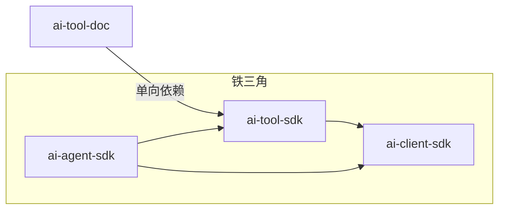
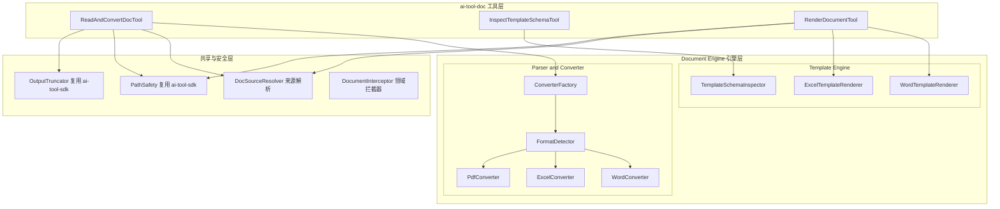
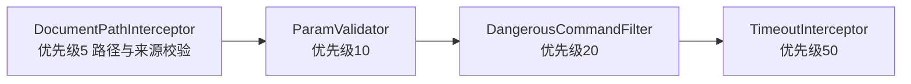

# ai-tool-doc 领域工具包设计计划

> 更新时间：2026-09-01 | 状态：规划中（Plan）| 定位：铁三角「中层领域工具扩展包」

---

## 一、定位与目标

`ai-tool-doc` 是铁三角架构中的**中层领域工具扩展包**，与 `ai-tool-db`、`ai-tool-monitor`、`ai-tool-rag`、`ai-tool-k8s` 同层。它基于 `ai-tool-sdk` 的 `@Tool` / `AgentTool` 契约实现一组**智能文档处理（IDP, Intelligent Document Processing）原子工具**，服务于「文档读取 → 语义降维 → 喂给 AI」与「AI 生成结构化数据 → 模板填充 → 导出报告」的双向闭环。

其核心定位一句话概括：

> **「输入层做语义降维（Document → Clean Markdown），输出层做结构化渲染（JSON/Data → Styled Docx）。」**

`ai-tool-doc` 具备**双重身份**：

1. **纯 Java 工具库模式**：不引入大模型时，业务系统直接调用内部的 `WordConverter` / `ExcelConverter` / `PdfConverter` / `TemplateRenderer`，完成 Word/Excel/PDF 解析或模板填充。
2. **AI Tool 模式**：通过 `DocToolFactory.createDocTools()` 包装为 3 个标准 `@Tool`，让 Agent 主动「读取文档内容」「探查模板占位字段」「填充模板生成报告」。

### 1.1 核心痛点与对策

| 痛点 | 表现 | `ai-tool-doc` 对策 |
|---|---|---|
| **格式双轨割裂** | `.doc`(HWPF) 与 `.docx`(XWPF) 是 POI 两套代码；`.xls`/`.xlsx` 单元格公式样式繁琐；PDF 文本提取易乱码/错位 | **统一 `Converter` 抽象**：内部按格式路由，自动 `.doc → .docx` 升级，对外只暴露 `Document → Markdown` 一个语义 |
| **纯文本丢失语义** | 直接提取 Plain Text 丢失 H1/H2 标题层级、表格结构、列表关系，AI 无法理解文档结构 | **结构化 Markdown 还原**：标题层级 → `#`，表格 → `\| col \| col \|`，列表/加粗/代码块 → 标准 Markdown 语法 |
| **正则替换损坏 Word** | 传统 `{{name}}` 字符串替换打断 Word 内部 XML 结构，导致文档损坏或样式丢失 | **poi-tl 模板渲染**：基于 XML 语法树，高保真渲染文本/图片/动态表格/列表，绝不破坏原排版 |
| **大 Excel 内存爆炸** | POI DOM 模式加载几万行导致 OOM | **SAX 流式解析 + 强制行数截断**，只读前 N 行并提示 Agent「数据已截断」 |

### 1.2 依赖规则（铁律）



- `ai-tool-doc` **只单向依赖 `ai-tool-sdk`**，绝不反向、绝不依赖 `ai-agent-sdk`。
- **POI / Tika / PDFBox / poi-tl / EasyExcel / JXLS 等所有文档解析与渲染依赖全部放在 `ai-tool-doc` 内**（`ai-tool-sdk` 铁律禁止引入业务/数据源依赖）。
- `ai-tool-doc` 只组合/实现 `@Tool`，不实现场景 Prompt 与 ReAct 编排（场景编排属于上层场景 SDK）。
- 文件路径统一复用 `ai-tool-sdk` 的 `PathSafety`，输出防爆统一复用 `OutputTruncator`，不重复造轮子。
- URL 下载复用 JDK 原生 `java.net.http.HttpClient`（遵守「禁止 OkHttp」工程铁律）。

### 1.3 本期范围（全量一期）

| 维度 | 内容 |
|---|---|
| 原子工具 | **3 个**：`read_and_convert_doc` / `inspect_template_schema` / `render_document` |
| 解析引擎 | **3 个 Converter**：`WordConverter` / `ExcelConverter` / `PdfConverter` + 统一 `ConverterFactory` + `FormatDetector` |
| 渲染引擎 | **2 个 Renderer**：`WordTemplateRenderer`（poi-tl）/ `ExcelTemplateRenderer`（EasyExcel/JXLS） |
| 模板探查 | **1 个 Inspector**：`TemplateSchemaInspector`（poi-tl 占位符解析 → JSON Schema） |
| 安全卡口 | 路径沙箱 + 文件大小卡口 + `.doc` 自动升级 + 大 Excel 流式截断 + 输出路径防覆盖 + 拦截器链 |

---

## 二、可拔插架构设计

### 2.1 Maven 模块

`ai-tool-doc` 作为独立子模块，**默认不加入父 POM 的 `<modules>` 聚合构建**（与 `ai-tool-db` / `ai-tool-monitor` 同策略），应用层按需在自身 `pom.xml` 中显式声明：

```xml
<dependency>
    <groupId>com.realapex</groupId>
    <artifactId>ai-tool-doc</artifactId>
    <version>1.0.0-SNAPSHOT</version>
</dependency>
```

关键点：

- `ai-tool-doc` 的 `ai-tool-sdk` 依赖声明为 **`compile` 作用域**（工具契约必需），但自身绝不反向被 `ai-tool-sdk` / `ai-agent-sdk` 引用。
- 文档解析依赖（`poi` / `poi-ooxml` / `poi-scratchpad` / `pdfbox` / `tika-core`）与渲染依赖（`poi-tl` / `easyexcel` / `jxls`）**只存在于 `ai-tool-doc` 的传递依赖树**，不污染 `ai-tool-sdk` / `ai-agent-sdk`。
- `poi-tl` 依赖 `poi-ooxml`，与解析层共用同一 POI 版本，统一在 `ai-tool-doc` 内做版本收敛，避免冲突。
- 应用层不引入 `ai-tool-doc` 时，编译产物中不存在任何文档处理相关类，满足「无文档场景零负担」。

### 2.2 依赖树对比

| 场景 | 引入依赖 | 效果 |
|---|---|---|
| 纯文件/命令场景 | 仅 `ai-tool-sdk` | 无 POI / PDFBox / poi-tl 字节码，包体最轻 |
| 文档处理场景 | `ai-tool-sdk` + `ai-tool-doc` | 获得 3 个原子工具 + 3 Converter + 2 Renderer + 模板 Schema 探查 + 安全卡口 |

---

## 三、核心架构与模块划分



数据流：

- **读路径**：`DocSourceResolver` 归一化来源（路径/URL/Base64）→ `FormatDetector` 判定格式 → `ConverterFactory` 路由到对应 Converter → 结构化 Markdown → `OutputTruncator` 防爆。
- **写路径**：`InspectTemplateSchemaTool` 探查占位符 → Agent 生成 JSON → `RenderDocumentTool` 调用 `WordTemplateRenderer` / `ExcelTemplateRenderer` 生成目标文件。

---

## 四、Parser & Converter 解析引擎（语义降维核心）

### 4.1 统一转换器接口 `DocumentConverter`

```java
/**
 * 文档转换器统一抽象：将一种格式文档转换为结构化 Markdown。
 * <p>实现类只需关注「某格式 → Markdown」的语义还原，
 * 格式路由由 {@link ConverterFactory} 负责，来源归一化由 DocSourceResolver 负责。</p>
 */
public interface DocumentConverter {

    /** 支持的格式标识（doc / docx / xls / xlsx / pdf） */
    String format();

    /** 是否支持该格式（含扩展名/魔数判定） */
    boolean supports(DocFormat format);

    /** 将文档转换为结构化 Markdown */
    DocConvertResult convert(Path file, DocConvertOptions options) throws Exception;
}
```

### 4.2 格式路由 `ConverterFactory` + `FormatDetector`

```java
public final class ConverterFactory {

    /** 按格式返回对应 Converter（内部缓存单例） */
    public static DocumentConverter create(DocFormat format);

    /** 按文件自动探测格式并返回 Converter */
    public static DocumentConverter detect(Path file);
}

public final class FormatDetector {
    /** 优先扩展名，其次魔数（zip 头 + Tika content-type 兜底），返回归一化 DocFormat */
    public static DocFormat detect(Path file) throws Exception;
}
```

`FormatDetector` 判定优先级：**扩展名 → 魔数（zip 头判定 OOXML/`%PDF` 判定 PDF）→ Tika `content-type` 兜底**。OOXML 系（`.docx`/`.xlsx`）本质是 zip，需进一步解析 `[Content_Types].xml` 或 `word/document.xml` 区分 Word 与 Excel。

### 4.3 Word 转换 `WordConverter`

```java
public final class WordConverter implements DocumentConverter {

    @Override
    public DocConvertResult convert(Path file, DocConvertOptions options) {
        // 1. .doc（HWPF）→ 先通过内部 docToDocx() 升级为 .docx（POI scratchpad + ooxml 转换）
        // 2. .docx（XWPF）→ 遍历 XWPFDocument 的 body elements：
        //    - XWPFParagraph：样式 Heading1~Heading9 → # ~ #######；加粗 → **text**；列表 → - / 1.
        //    - XWPFTable：逐 cell 读取 → | col1 | col2 |；首行判定为表头 → 追加 --- 分隔行
        //    - XWPFPicture / 内嵌图片 → 提取为图片资源，占位替换为 
        // 3. 分页/分节 → 按 options.maxPages 截断，超限附加「内容已截断」提示
    }
}
```

**Word → Markdown 映射规则**：

| Word 元素 | Markdown 输出 |
|---|---|
| Heading 1~6 | `#` ~ `######` |
| 普通段落 | 纯文本（保留行内加粗 `**`、斜体 `*`、代码 `` ` ``） |
| 有序/无序列表 | `1.` / `-`（按 numbering 层级缩进） |
| 表格 | `\| col1 \| col2 \|` + `\|---\|---\|` 表头分隔行 |
| 内嵌图片 | 提取为资源后替换 ``（供多模态 LLM 使用） |

### 4.4 Excel 转换 `ExcelConverter`（流式 + 强制截断）

```java
public final class ExcelConverter implements DocumentConverter {

    @Override
    public DocConvertResult convert(Path file, DocConvertOptions options) {
        // 1. .xls（HSSF）→ 若行数小用 POI Event API / 若需升级用 HSSF → XSSF 转换
        // 2. .xlsx（XSSF）→ 使用 SAX 流式解析（XSSFReader + SheetHandler），严禁 DOM 全量加载
        // 3. 每个 Sheet 输出为一个 Markdown 表格块（以 ## Sheet 名 作为二级标题）
        // 4. 强制截断：行数超过 options.maxRows（默认 100）、列数超过 options.maxCols（默认 50）
        //    → 截断并附加 "[...Excel truncated, 共 N 行 M 列，仅显示前 100 行...]"
    }
}
```

**大 Excel 内存保护铁律**：

- `.xlsx` 一律走 **POI SAX 流式解析**（`XSSFReader` + `ContentHandler`），不构建 `XSSFWorkbook` 全量 DOM。
- 可选引入 EasyExcel 作为更高层流式封装；无论哪种，**必须强制行/列截断**，只返回摘要切片。
- 单元格公式：默认取缓存值（`cachedValue`），不重算公式（避免触发重计算导致慢查询）。

### 4.5 PDF 转换 `PdfConverter`

```java
public final class PdfConverter implements DocumentConverter {

    @Override
    public DocConvertResult convert(Path file, DocConvertOptions options) {
        // 1. PDFBox 加载（LoadNonSeq 处理损坏文件容错）
        // 2. 逐页提取文本，按页码生成 "## Page N" 分段
        // 3. 段落错位修正：合并被硬换行打断的段落（按行尾标点/字号启发式合并）
        // 4. options.maxPages（默认 50）截断，超限附加「页数已截断」提示
        // 5. 扫描版 PDF（无可提取文本）→ 返回提示「该 PDF 为扫描件，需 OCR（留待后续）」
    }
}
```

> OCR 能力（tesseract 集成）不在本期范围，扫描件仅做显式提示降级，不静默返回空文本。

### 4.6 来源归一化 `DocSourceResolver`

统一处理工具入参的三种来源，归一化为本地临时 `Path`：

```java
public final class DocSourceResolver {

    /** 本地路径：复用 PathSafety.resolveSafePath 做沙箱校验 */
    public static Path resolvePath(String filePath, Path baseDir);

    /** URL：JDK HttpClient 下载到临时目录，含超时与大小上限 */
    public static Path resolveUrl(String url, DocToolConfig config);

    /** Base64：解码为字节后落盘临时文件，含大小上限 */
    public static Path resolveBase64(String base64, DocToolConfig config);
}
```

---

## 五、Template Engine 模板引擎（结构化渲染核心）

### 5.1 模板 Schema 探查 `TemplateSchemaInspector`

大模型填模板前必须知道模板「需要哪些变量」。Inspector 扫描 poi-tl 模板，解析全部占位符并生成 JSON Schema：

```java
public final class TemplateSchemaInspector {

    /**
     * 解析 .docx 模板中的 poi-tl 占位符，输出结构化字段清单。
     * <p>支持的占位符语法（poi-tl 规范）：</p>
     * <ul>
     *   <li>{{var}} 纯文本</li>
     *   <li>{{#list}} ... {{/list}} 循环表格/段落</li>
     *   <li>{{@img}} 图片</li>
     * </ul>
     */
    public TemplateSchema inspect(Path templateFile) throws Exception;
}
```

输出示例：

```json
{
  "template": "monthly_report_template.docx",
  "fields": [
    { "name": "reportTitle", "type": "text", "required": true },
    { "name": "systemName", "type": "text", "required": true },
    { "name": "avgQps", "type": "text", "required": true },
    { "name": "errorSummary", "type": "text", "required": true },
    { "name": "slowSqlList", "type": "table", "required": false, "columns": ["sql", "costMs", "rows"] },
    { "name": "trendChart", "type": "image", "required": false }
  ]
}
```

> 占位符解析采用「段落/表格逐元素扫描正则」方式提取 `{{...}}` 标签，并区分 text / table（`{{#...}}` 循环）/ image（`{{@...}}`）三类语义，映射为结构化 Schema 供 Agent 生成数据。

### 5.2 Word 模板渲染 `WordTemplateRenderer`（poi-tl）

```java
public final class WordTemplateRenderer {

    /**
     * 将结构化数据渲染进 .docx 模板，生成新文档。
     * <p>基于 poi-tl（POI Template Language），高保真渲染文本/图片/循环表格/列表，
     * 不破坏原模板排版。</p>
     */
    public RenderResult render(Path templateFile, Map<String, Object> data, Path outputFile) throws Exception;
}
```

- 模板语法采用 poi-tl 的 Mustache 风格 `{{var}}`，天然支持：
  - **文本**：`{{name}}`
  - **图片**：`{{@img}}`（data 传 `PictureRenderData`）
  - **循环表格/列表**：`{{#list}} ... {{/list}}`（自动扩行）
- 渲染后可选转换为 PDF（通过 docx → pdf 转换，本期以 docx 为主，PDF 转换留作可选增强）。

### 5.3 Excel 模板渲染 `ExcelTemplateRenderer`（EasyExcel / JXLS）

```java
public final class ExcelTemplateRenderer {

    /** 将数据渲染进 Excel 模板（支持动态填充 + 格式继承） */
    public RenderResult render(Path templateFile, Map<String, Object> data, Path outputFile) throws Exception;
}
```

- 优先 EasyExcel 的模板填充能力（`fill`），复杂公式/嵌套场景回退 JXLS。
- 渲染大结果集同样走流式写入，避免 OOM。

### 5.4 渲染结果与输出路径安全

- 输出文件必须位于 `config.outputDir`（沙箱）内，复用 `PathSafety.resolveSafePath` 校验，**禁止覆盖输入模板**（路径相同即拒绝）。
- 输出文件名冲突时自动追加时间戳后缀，避免覆盖已有文件。

---

## 六、三大原子工具定义

> 工具命名统一为 `snake_case`，与 `ai-tool-sdk` 基础工具及 `ai-tool-db` / `ai-tool-monitor` 命名风格一致。

### 6.1 文档阅读 `ReadAndConvertDocTool`

| 项 | 内容 |
|---|---|
| 工具名 | `read_and_convert_doc` |
| 类名 | `ReadAndConvertDocTool` |
| 职责 | 读取 Word/Excel/PDF，转换为带标题层级、表格、列表的标准 Markdown |
| 入参 | `DocConvertRequest`（source：filePath / url / base64、format 可选、maxRows、maxPages） |
| 出参 | `DocConvertResult`（markdown 文本 + 元数据：页数/字数/截断标记/图片列表） |
| 引擎 | `DocSourceResolver` + `FormatDetector` + `ConverterFactory` + 3 Converter |
| 安全 | `readOnly = true`，路径沙箱 + 大小卡口 + 流式截断 + `OutputTruncator` 防爆 |

### 6.2 模板探查 `InspectTemplateSchemaTool`

| 项 | 内容 |
|---|---|
| 工具名 | `inspect_template_schema` |
| 类名 | `InspectTemplateSchemaTool` |
| 职责 | 扫描 `.docx` 模板，解析全部占位符，返回结构化字段清单（JSON Schema） |
| 入参 | `TemplateSchemaRequest`（templatePath） |
| 出参 | `TemplateSchema`（模板名 + 字段列表：name/type/required/columns） |
| 引擎 | `TemplateSchemaInspector` |
| 安全 | `readOnly = true`，路径沙箱 + 大小卡口 |

### 6.3 报告渲染 `RenderDocumentTool`

| 项 | 内容 |
|---|---|
| 工具名 | `render_document` |
| 类名 | `RenderDocumentTool` |
| 职责 | 接收 Agent 生成的结构化 JSON 数据，填入模板生成 Word/Excel 报告 |
| 入参 | `RenderRequest`（templatePath、data JSON、outputFormat、outputPath 可选） |
| 出参 | `RenderResult`（输出文件路径、格式、大小） |
| 引擎 | `WordTemplateRenderer` / `ExcelTemplateRenderer`（按模板格式路由） |
| 安全 | `readOnly = false`（写文件），**`requiresApproval = false`**（生成的是用户自己的工作产物，非高危外部副作用；可选开关可提升为 HITL）+ 输出路径防覆盖 |

> 典型 ReAct 路径：`inspect_template_schema` 探查字段 → Agent 调用 `ai-tool-monitor` / `ai-tool-db` 收集数据 → Agent 整理 JSON → `render_document` 生成报告 → 复用 `ai-tool-sdk` 的 `read_file` / `read_and_convert_doc` 自检产物。

---

## 七、安全防御与性能控制

### 7.1 路径沙箱（复用 `ai-tool-sdk`）

- 所有本地输入/输出路径统一走 `PathSafety.resolveSafePath(config.baseDir(), path)`，拦截 `../../etc/passwd` 等路径穿越。
- URL / Base64 来源下载后的临时文件仅落在 `config.tempDir`，不触碰沙箱外。

### 7.2 文件大小卡口

| 卡口 | 规则 |
|---|---|
| `maxDocSizeBytes` | 输入文档大小上限（默认 **20MB**，文档天然大于代码，故区别于 `BaseToolConfig` 的 2MB 单文件上限） |
| 下载/解码大小上限 | URL 下载与 Base64 解码同样受 `maxDocSizeBytes` 约束，超限拒绝并提示 |

### 7.3 语义降维防爆（三重合围）

| 层 | 机制 |
|---|---|
| 分片截断 | PDF 按 `maxPages`（默认 50）截断；Excel 按 `maxRows`（默认 100）/`maxCols`（默认 50）截断；Word 按 `maxPages`/字数截断 |
| 结构降维 | 标题/表格/列表还原为 Markdown，图片以 `doc://{fileId}` 占位，不把原始二进制塞给 LLM |
| Token 防爆 | 复用 `OutputTruncator.truncate()` 做最终兜底，超限自动截断 + 附加提示 |

### 7.4 `.doc` 自动升级

- `.doc`（Word 97-2003）不支持 poi-tl 高级渲染，且 HWPF 解析能力弱。检测到 `.doc` 时，内部自动用 POI（`HWPFDocument` + `XWPFDocument`）升级为 `.docx` 再处理。
- 升级失败时降级返回 HWPF 纯文本提取结果，并提示 Agent「老旧格式已降级解析」。

### 7.5 输出路径防覆盖

- `render_document` 输出路径必须位于 `outputDir` 内，且**禁止与输入模板路径相同**。
- 目标文件已存在时自动追加时间戳后缀，防止静默覆盖用户已有文件。

### 7.6 拦截器链 `DocumentPathInterceptor`

新增领域专属拦截器（实现 `ai-tool-sdk` 的 `ToolSecurityInterceptor`），先于通用链执行：



- `DocumentPathInterceptor` 是 `ai-tool-doc` 领域专属拦截器，只在 `ai-tool-doc` 内注册，校验入参路径是否位于沙箱、来源是否合法（仅允许 http/https URL），不影响 `ai-tool-sdk` 通用链。
- `read_and_convert_doc` / `inspect_template_schema` 为 `readOnly = true`；`render_document` 为写操作但默认不触发 HITL（可配置提升）。

---

## 八、包结构与类清单

```
ai-tool-doc/
 ├── pom.xml                                # 依赖 ai-tool-sdk + poi + poi-ooxml + poi-scratchpad + pdfbox + tika-core + poi-tl + easyexcel + jxls + jackson + slf4j + lombok
 └── src/main/java/com/realapex/tool/doc/
     ├── config/
     │   ├── DocToolConfig.java             # baseDir/outputDir/tempDir/大小卡口/截断参数/超时/渲染选项
     │   └── DocToolFactory.java            # createDocTools(...) 一键创建 3 个工具 + 暴露引擎单例
     ├── engine/
     │   ├── convert/
     │   │   ├── DocumentConverter.java      # 转换器统一接口
     │   │   ├── ConverterFactory.java       # 按格式路由 + 单例缓存
     │   │   ├── FormatDetector.java         # 扩展名 + 魔数 + Tika 兜底
     │   │   ├── DocSourceResolver.java      # 路径/URL/Base64 归一化
     │   │   ├── WordConverter.java          # Word → Markdown（.doc 自动升级）
     │   │   ├── ExcelConverter.java         # Excel → Markdown（SAX 流式 + 截断）
     │   │   └── PdfConverter.java           # PDF → Markdown（逐页 + 段落修正）
     │   └── template/
     │       ├── TemplateSchemaInspector.java # poi-tl 占位符 → JSON Schema
     │       ├── WordTemplateRenderer.java    # poi-tl 高保真 Word 渲染
     │       └── ExcelTemplateRenderer.java   # EasyExcel/JXLS Excel 渲染
     ├── tool/
     │   ├── ReadAndConvertDocTool.java      # read_and_convert_doc
     │   ├── InspectTemplateSchemaTool.java  # inspect_template_schema
     │   └── RenderDocumentTool.java         # render_document
     ├── security/
     │   └── DocumentPathInterceptor.java    # 路径/来源校验拦截器
     ├── model/
     │   ├── DocFormat.java                  # doc/docx/xls/xlsx/pdf 枚举
     │   ├── DocConvertRequest.java
     │   ├── DocConvertResult.java
     │   ├── DocConvertOptions.java
     │   ├── TemplateSchemaRequest.java
     │   ├── TemplateSchema.java
     │   ├── TemplateField.java              # name/type/required/columns
     │   ├── RenderRequest.java
     │   └── RenderResult.java
     └── autoconfigure/
         └── DocToolAutoConfiguration.java    # Spring Boot 可选自动装配
```

---

## 九、配置与接入方式（通用）

### 9.1 核心配置 `DocToolConfig`

```java
@Builder
public class DocToolConfig {

    /** 沙箱根目录（输入/输出路径统一限定在其内） */
    private Path baseDir;

    /** 渲染输出目录（默认 baseDir/output） */
    private Path outputDir;

    /** 临时目录（URL/Base64 下载落盘，默认 baseDir/temp） */
    private Path tempDir;

    /** 输入文档大小上限（默认 20MB） */
    @Builder.Default private long maxDocSizeBytes = 20 * 1024 * 1024L;

    /** 返回结果截断上限（复用 OutputTruncator，默认 20000 字符） */
    @Builder.Default private int maxOutputChars = 20_000;

    /** PDF 最大解析页数（默认 50） */
    @Builder.Default private int maxPages = 50;

    /** Excel 最大解析行数（默认 100，防 OOM） */
    @Builder.Default private int maxRows = 100;

    /** Excel 最大解析列数（默认 50） */
    @Builder.Default private int maxCols = 50;

    /** 是否提取文档内图片（默认 true，提取后以 doc://fileId 占位） */
    @Builder.Default private boolean extractImages = true;

    /** .doc 是否自动升级为 .docx（默认 true） */
    @Builder.Default private boolean autoUpgradeDoc = true;

    /** 渲染是否触发 HITL 审批（默认 false，可配置提升为 true） */
    @Builder.Default private boolean renderRequiresApproval = false;

    /** 下载/解析超时（默认 30s，网络 I/O 必须有超时） */
    @Builder.Default private long timeoutMs = 30_000;
}
```

### 9.2 编程式（纯 Java）— 双重身份

```java
DocToolConfig config = DocToolConfig.builder()
        .baseDir(Path.of("/home/workspace/project-a"))
        .maxDocSizeBytes(20 * 1024 * 1024L)
        .maxRows(100)
        .build();

// 身份一：AI Tool 模式 —— 一键创建 3 个工具
List<AgentTool<?, ?>> docTools = DocToolFactory.createDocTools(config);

agentRunner.run(AgentRequest.builder()
        .userPrompt("读取季度报告并总结关键结论")
        .tools(docTools)
        .build());

// 身份二：纯 Java 工具库模式 —— 引擎可独立注入，不依赖大模型
String markdown = new WordConverter().convert(Path.of("a.docx"), DocConvertOptions.defaults()).markdown();
RenderResult result = new WordTemplateRenderer().render(tpl, data, outFile);
```

### 9.3 Spring Boot 自动装配（可选）

```yaml
ai:
  tool:
    doc:
      base-dir: /home/workspace/project-a
      output-dir: /home/workspace/project-a/output
      temp-dir: /home/workspace/project-a/temp
      max-doc-size-bytes: 20971520
      max-output-chars: 20000
      max-pages: 50
      max-rows: 100
      max-cols: 50
      extract-images: true
      auto-upgrade-doc: true
      render-requires-approval: false
      timeout-ms: 30000
```

`DocToolAutoConfiguration` 在配置了 `base-dir` 时自动装配 3 个工具，并通过 `ToolBeanPostProcessor`（来自 `ai-agent-sdk`）自动注册到 `ToolRegistry`。

---

## 十、格式支持矩阵

| 格式 | 扩展名 | 解析为 Markdown | 模板 Schema 探查 | 模板渲染 | 特殊处理 |
|---|---|---|---|---|---|
| Word 2003 | `.doc` | ✅ HWPF（自动升级 .docx） | ✅（升级后） | ❌（poi-tl 仅 .docx，需先升级） | `.doc → .docx` 自动升级 |
| Word 2007+ | `.docx` | ✅ XWPF 结构化还原 | ✅ poi-tl 占位符解析 | ✅ poi-tl 高保真渲染 | 标题/表格/图片/列表还原 |
| Excel 2003 | `.xls` | ✅ HSSF Event API | ❌ | ⚠️ EasyExcel/JXLS（有限） | 流式解析 |
| Excel 2007+ | `.xlsx` | ✅ XSSFReader SAX 流式 | ❌ | ✅ EasyExcel fill | 强制行/列截断 |
| PDF | `.pdf` | ✅ PDFBox 逐页 | ❌ | ❌ | 段落错位修正 + 扫描件提示 |

> 归一化目标：三种解析入口统一吐出 `DocConvertResult`（markdown + 元数据），屏蔽底层 POI/PDFBox/Tika 差异；渲染入口统一吐出 `RenderResult`，让上层 Agent 无需感知厂商与格式细节。

---

## 十一、实施步骤（Action Items）

| 序号 | 步骤 | 产出 | 依赖 |
|---|---|---|---|
| 1 | 建立 `ai-tool-doc` Maven 模块，声明依赖 `ai-tool-sdk` + POI 全家桶 + PDFBox + Tika + poi-tl + EasyExcel + JXLS | `pom.xml` | — |
| 2 | 定义 `DocFormat` 枚举 + `FormatDetector`（扩展名/魔数/Tika 兜底）+ `ConverterFactory` | 格式路由层 | 1 |
| 3 | 定义 `DocumentConverter` 接口 + `DocSourceResolver`（路径/URL/Base64 归一化） | 转换器抽象 + 来源归一化 | 1 |
| 4 | 实现 `WordConverter`（含 `.doc` 自动升级 + 标题/表格/图片 Markdown 还原） | Word 解析 | 2、3 |
| 5 | 实现 `ExcelConverter`（SAX 流式 + 行/列截断） | Excel 解析 | 2、3 |
| 6 | 实现 `PdfConverter`（逐页 + 段落修正 + 扫描件降级） | PDF 解析 | 2、3 |
| 7 | 定义全部 `model`（入参/出参 Record，含 `DocConvertOptions` / `TemplateField`） | 数据模型 | — |
| 8 | 实现 `TemplateSchemaInspector`（poi-tl 占位符 → JSON Schema） | 模板探查引擎 | 7 |
| 9 | 实现 `WordTemplateRenderer`（poi-tl）+ `ExcelTemplateRenderer`（EasyExcel/JXLS） | 渲染引擎 | 7 |
| 10 | 实现 `DocumentPathInterceptor` 领域拦截器 | 安全层 | 7 |
| 11 | 实现 `DocToolConfig` + `DocToolFactory` + 3 个原子工具 | 工具层 | 4、5、6、8、9、10 |
| 12 | 实现 `DocToolAutoConfiguration` Spring 可选装配 | 自动装配 | 11 |
| 13 | 编译验证 + 单元测试（格式路由、Word/Excel/PDF 转 MD、`.doc` 升级、大 Excel 截断、模板 Schema 解析、渲染、路径穿越拦截、防爆） | 测试 | 全部 |

---

## 十二、设计决策定稿

| # | 决策点 | 定稿结论 |
|---|---|---|
| 1 | 包命名 | **`ai-tool-doc`**（扩展工具包不带 `-sdk` 后缀，区别于基础设施 SDK） |
| 2 | 工具集 | **3 个原子工具**：`read_and_convert_doc` / `inspect_template_schema` / `render_document`，本期全部实现 |
| 3 | 双重身份 | 引擎与工具分离：`Converter`/`Renderer` 可独立注入（纯 Java 库），`DocToolFactory.createDocTools()` 包装为 `@Tool`（AI 模式） |
| 4 | 解析技术 | **Apache POI（Office）+ PDFBox（PDF）+ Tika-core（类型探测兜底）**；Markdown 还原为自研轻量转换，不引 Flexmark（避免多余依赖） |
| 5 | 渲染技术 | **poi-tl（Word 高保真）+ EasyExcel/JXLS（Excel）**，基于 XML 语法树/流式，不破坏模板排版 |
| 6 | `.doc` 兼容 | 检测到 `.doc` 自动升级 `.docx`（POI scratchpad + ooxml），升级失败降级 HWPF 纯文本 |
| 7 | 大 Excel 保护 | `.xlsx` 强制 **SAX 流式解析**，严禁 DOM 全量加载；强制 `maxRows=100` / `maxCols=50` 截断 |
| 8 | 来源归一化 | 路径/URL/Base64 三态统一由 `DocSourceResolver` 归一到沙箱内临时 Path，URL 仅允许 http/https |
| 9 | 防爆三合围 | 分片截断（页/行/列）+ 结构降维（图片占位）+ `OutputTruncator` 兜底 |
| 10 | 安全 | 复用 `PathSafety` 沙箱 + `DocumentPathInterceptor` 领域拦截器；渲染输出禁止覆盖输入模板，文件名冲突追加时间戳 |
| 11 | 审批策略 | `read_and_convert_doc` / `inspect_template_schema` 为 `readOnly=true`；`render_document` 写操作默认不触发 HITL（可配置提升） |
| 12 | 扫描件 PDF | 无可提取文本时显式提示「需 OCR」，OCR（tesseract）留待后续迭代，不静默返回空文本 |
