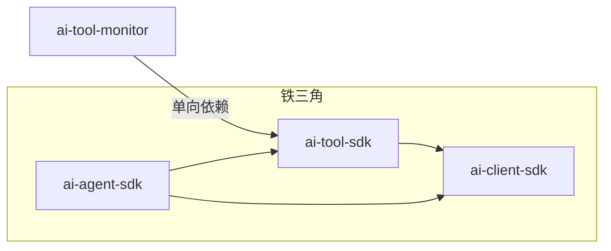
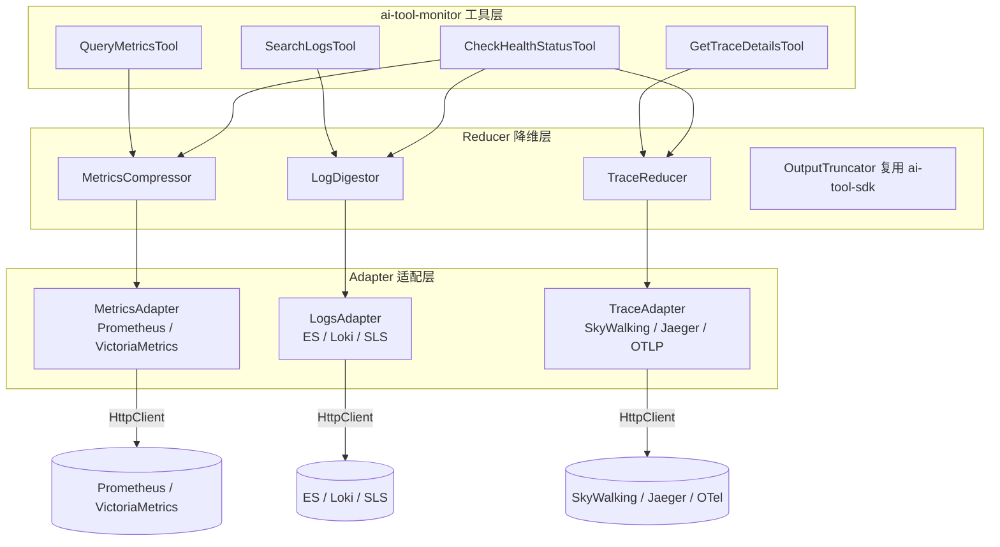
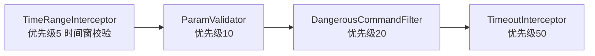

# ai-tool-monitor 领域工具包设计计划

> 更新时间：2026-09-01 | 状态：规划中（Plan）| 定位：铁三角「中层领域工具扩展包」

---

## 一、定位与目标

`ai-tool-monitor` 是铁三角架构中的**中层领域工具扩展包**，与 `ai-tool-db`、`ai-tool-rag`、`ai-tool-k8s` 同层。它基于 `ai-tool-sdk` 的 `@Tool` / `AgentTool` 契约实现一组**可观测性（Observability）原子探查工具**，服务于系统健康度评估、指标异常分析、日志故障定位、慢请求链路诊断等 SRE 场景。

其核心定位一句话概括：

> **「屏蔽底层监控平台 API 细节，将庞杂的时间序列与海量日志做降维处理，为 Agent 提供精准的系统健康度探查能力。」**

### 1.1 核心痛点与降维设计理念

直接让大模型调 Prometheus 或 Elasticsearch 的 API，会面临三个致命问题：

| 痛点 | 表现 | `ai-tool-monitor` 对策 |
|---|---|---|
| **DSL 极其复杂** | PromQL / ES Query DSL 语法门槛高，Agent 极易写错语法 | **模板化查询**：工具入参只用 `metricName / service / level / timeRange / traceId` 等业务语义，`PromQLTemplate` / `LogQueryTemplate` 在内部完成 DSL 拼装 |
| **数据量爆炸（Context 爆炸）** | Prometheus 返回成百上千采样点，ES 返回几千行原始 JSON，塞给 LLM 瞬间挤爆 Token | **数据前置降维（Reducer）**：在 Java 内部先做统计分析/去重聚合，只把摘要喂给 Agent |
| **缺少指标关联性** | 排查需同时看 Metrics / Logs / Traces，应用层很难写干净关联逻辑 | **统一模型 + 关联键**：`service` + `timeRange` + `traceId` 贯穿三族，`check_health_status` 一键聚合三者输出健康评分 |

因此 `ai-tool-monitor` 的核心设计哲学是 **「模板化查询 + 数据前置降维（Data Reduction）」**。

### 1.2 依赖规则（铁律）



- `ai-tool-monitor` **只单向依赖 `ai-tool-sdk`**，绝不反向、绝不依赖 `ai-agent-sdk`。
- **Prometheus / ES / Loki / SLS / SkyWalking / Jaeger / OTLP 等所有监控/日志/链路客户端依赖全部放在 `ai-tool-monitor` 内**（`ai-tool-sdk` 铁律禁止引入业务/数据源依赖）。
- `ai-tool-monitor` 只组合/实现 `@Tool`，不实现场景 Prompt 与 ReAct 编排（场景编排属于上层场景 SDK，如 `ai-scenario-ops-sdk`）。
- 网络 I/O 统一通过 JDK 原生 `java.net.http.HttpClient` 完成，遵守「禁止 OkHttp」工程铁律；厂商客户端均以 HTTP API 方式接入，**不引入重量级厂商 SDK**（如 ES High Level REST Client、SkyWalking Client），保持包体轻量与可拔插。

### 1.3 本期范围（全量一期）

| 维度 | 内容 |
|---|---|
| 原子工具 | **4 个**：`query_metrics` / `search_logs` / `get_trace_details` / `check_health_status` |
| 降维算法 | **3 个**：`MetricsCompressor` / `LogDigestor` / `TraceReducer` |
| 适配器 | **3 族 8 个**：Metrics 2 个 + Logs 3 个 + Trace 3 个 |
| 安全卡口 | 时间窗限制 + 数据大小卡口 + 敏感信息脱敏 + 拦截器链 |

---

## 二、可拔插架构设计

### 2.1 Maven 模块

`ai-tool-monitor` 作为独立子模块，**默认不加入父 POM 的 `<modules>` 聚合构建**（与 `ai-tool-db` 同策略），应用层按需在自身 `pom.xml` 中显式声明：

```xml
<dependency>
    <groupId>com.realapex</groupId>
    <artifactId>ai-tool-monitor</artifactId>
    <version>1.0.0-SNAPSHOT</version>
</dependency>
```

关键点：

- `ai-tool-monitor` 的 `ai-tool-sdk` 依赖声明为 **`compile` 作用域**（工具契约必需），但自身绝不反向被 `ai-tool-sdk` / `ai-agent-sdk` 引用。
- 网络访问仅依赖 JDK 原生 `HttpClient`，不引入 OkHttp；JSON 复用 Jackson。
- 各厂商客户端均以 HTTP API 对接，**不引入厂商官方 Java SDK**，避免传递依赖污染。
- 应用层不引入 `ai-tool-monitor` 时，编译产物中不存在任何监控/日志/链路相关类，满足「无监控场景零负担」。

### 2.2 依赖树对比

| 场景 | 引入依赖 | 效果 |
|---|---|---|
| 纯文件/命令场景 | 仅 `ai-tool-sdk` | 无监控客户端字节码，包体最轻 |
| 可观测性场景 | `ai-tool-sdk` + `ai-tool-monitor` | 获得 4 个探查工具 + 3 族 8 适配器 + 降维算法 + 安全卡口 |

---

## 三、核心架构与模块划分



数据流：**工具 → Reducer（降维）→ Adapter（协议适配）→ HttpClient → 监控平台**；响应逆向回传，Reducer 在回传路径上完成摘要化。

---

## 四、Adapter 适配层设计（多厂商兼容）

### 4.1 三族接口

```java
/** Metrics 适配器：查询时序指标，返回原始采样点（交由 MetricsCompressor 降维） */
public interface MetricsAdapter {
    /** 适配器名称（prometheus / victoriametrics） */
    String name();
    /** 查询指标，返回原始时序点列表 */
    List<TimeSeriesPoint> query(String metricName, TimeRange range, Map<String, String> labels) throws Exception;
}

/** Logs 适配器：检索日志，返回原始日志事件（交由 LogDigestor 降维） */
public interface LogsAdapter {
    String name();
    /** 检索日志，返回原始日志事件列表 */
    List<LogEvent> search(LogQuery query) throws Exception;
}

/** Trace 适配器：按 TraceId 获取调用链，返回节点列表（交由 TraceReducer 降维） */
public interface TraceAdapter {
    String name();
    /** 按 TraceId 获取完整调用链节点 */
    List<TraceSpan> getTrace(String traceId, TimeRange range) throws Exception;
}
```

### 4.2 八厂商实现划分

| 族 | 接口 | 实现类 | 对接方式 | 说明 |
|---|---|---|---|---|
| Metrics | `MetricsAdapter` | `PrometheusMetricsAdapter` | Prometheus HTTP API `query_range` | 标准 PromQL 模板注入；VictoriaMetrics 兼容 PromQL，复用同一适配器 |
| Metrics | `MetricsAdapter` | `VictoriaMetricsAdapter` | VictoriaMetrics HTTP API | 与 Prometheus 同协议，**继承 `PrometheusMetricsAdapter` 仅覆盖 baseUrl 语义**，降低重复代码 |
| Logs | `LogsAdapter` | `ElasticsearchLogsAdapter` | ES `_search` REST API | 基于 JDK HttpClient + JSON DTO，不引 ES 官方 Client |
| Logs | `LogsAdapter` | `LokiLogsAdapter` | Loki HTTP API（LogQL） | LogQL 模板注入 |
| Logs | `LogsAdapter` | `AliyunSlsLogsAdapter` | 阿里云 SLS OpenAPI | 直连 SLS 查询接口 |
| Trace | `TraceAdapter` | `SkyWalkingTraceAdapter` | SkyWalking GraphQL / REST API | 按 TraceId 查调用链树 |
| Trace | `TraceAdapter` | `OpenTelemetryTraceAdapter` | OTLP / Jaeger HTTP API | Jaeger 兼容 OTel 语义，复用同一适配器 |
| Trace | `TraceAdapter` | `JaegerTraceAdapter` | Jaeger HTTP API | **继承 `OpenTelemetryTraceAdapter` 覆盖查询端点**，降低重复代码 |

> 说明：VictoriaMetrics 与 Jaeger 分别兼容 Prometheus 与 OpenTelemetry 协议，因此 8 个实现类中有 2 个通过继承方式复用，避免重复代码。模板注入（PromQL / LogQL / ES Query DSL）统一收敛到各适配器内部，对上层工具透明。

### 4.3 工厂 `MonitorAdapterFactory`

```java
public final class MonitorAdapterFactory {
    /** 按厂商名创建适配器，prometheus/victoriametrics→MetricsAdapter，es/loki/sls→LogsAdapter，skywalking/jaeger/otel→TraceAdapter */
    public static MetricsAdapter createMetricsAdapter(String provider, MonitorToolConfig config);
    public static LogsAdapter createLogsAdapter(String provider, MonitorToolConfig config);
    public static TraceAdapter createTraceAdapter(String provider, MonitorToolConfig config);
}
```

---

## 五、Reducer 降维层（核心算法）

> 降维层是 `ai-tool-monitor` 的**灵魂**。它只接收 Adapter 吐出的原始数据，输出高度浓缩的摘要结构，是防止 Context 爆炸的第一道防线。

### 5.1 时序降维 `MetricsCompressor`

将成百上千个时序采样点压缩为一条摘要，**不返回时间序列数组**：

```java
public final class MetricsCompressor {

    public static MetricsSummary compress(String metricName, List<TimeSeriesPoint> points) {
        if (points.isEmpty()) return MetricsSummary.empty(metricName);

        double max = points.stream().mapToDouble(TimeSeriesPoint::value).max().orElse(0.0);
        double min = points.stream().mapToDouble(TimeSeriesPoint::value).min().orElse(0.0);
        double avg = points.stream().mapToDouble(TimeSeriesPoint::value).average().orElse(0.0);
        double latest = points.get(points.size() - 1).value();
        double p95 = percentile(points, 0.95);
        double p99 = percentile(points, 0.99);
        String trend = calculateTrend(points); // FAST_RISING / RISING / STABLE / DECLINING

        return MetricsSummary.builder()
                .metric(metricName)
                .latest(round(latest))
                .max(round(max))
                .min(round(min))
                .avg(round(avg))
                .p95(round(p95))
                .p99(round(p99))
                .trend(trend)
                .build();
    }
}
```

Agent 最终接收到的工具结果：

> `{"metric": "cpu_usage", "latest": 85.2, "max": 92.1, "avg": 60.4, "p95": 88.6, "p99": 91.0, "trend": "FAST_RISING"}`
> *(只消耗约 20 个 Token，但包含了 Agent 做推演所需的全部关键数据)*

### 5.2 日志去重与特征提取 `LogDigestor`

生产环境中一个 Exception 可能一秒刷出上千条相同报错，`LogDigestor` 做三层处理：

1. **哈希去重**：提取 `ExceptionName + 业务栈顶行` 计算 MD5 指纹，将上千条日志归类为同一类事件。
2. **堆栈裁切**：去掉 `org.springframework` 等框架层面长堆栈，只保留业务代码调用栈顶（首个非框架包）。
3. **结构化压缩**：按 `ErrorSignature` 聚合，只输出最关键的 Top-N（默认 3~5）类异常摘要。

```json
{
  "totalErrorCount": 1420,
  "distinctExceptions": [
    {
      "type": "java.sql.SQLTimeoutException",
      "count": 1380,
      "firstSeen": "14:02:01",
      "sampleStackTrace": "com.company.order.dao.OrderMapper.queryOrder(OrderMapper.java:45)",
      "message": "Lock wait timeout exceeded; try restarting transaction"
    }
  ]
}
```

```java
public final class LogDigestor {

    /** 计算错误特征指纹：md5(exceptionType + 业务栈顶行) */
    public static String fingerprint(LogEvent event) { /* ... */ }

    /** 将海量日志聚合为 Top-N 异常摘要 */
    public static LogsSummary digest(List<LogEvent> events, int topN) { /* ... */ }
}
```

### 5.3 链路降维 `TraceReducer`

过滤正常节点，仅高亮两类关键节点，避免整棵调用链撑爆 Context：

1. **瓶颈节点**：延时占比超过总耗时 50% 的节点。
2. **异常节点**：携带 Error 标记的节点。

```java
public final class TraceReducer {

    /** 过滤正常节点，仅保留瓶颈节点 + 异常节点 */
    public static TraceSummary reduce(List<TraceSpan> spans, long totalDurationMs) { /* ... */ }
}
```

---

## 六、四大原子工具定义

> 工具命名统一为 `snake_case`，与 `ai-tool-sdk` 基础工具及 `ai-tool-db` 命名风格一致。

### 6.1 指标查询 `QueryMetricsTool`

| 项 | 内容 |
|---|---|
| 工具名 | `query_metrics` |
| 类名 | `QueryMetricsTool` |
| 职责 | 查询 CPU、内存、QPS、P99 延时、JVM GC 等性能指标 |
| 入参 | `MetricsRequest`（metricName、service、timeRange、labels） |
| 出参 | `MetricsSummary`（latest/max/min/avg/p95/p99/trend，**无时间序列点**） |
| Reducer | `MetricsCompressor` |
| 安全 | `readOnly = true`，时间窗硬性限制 |

### 6.2 日志检索 `SearchLogsTool`

| 项 | 内容 |
|---|---|
| 工具名 | `search_logs` |
| 类名 | `SearchLogsTool` |
| 职责 | 按服务名、Log Level（如 ERROR）、时间范围检索关键日志 |
| 入参 | `LogsRequest`（service、level、timeRange、keyword、topN） |
| 出参 | `LogsSummary`（totalErrorCount + Top-N 异常摘要） |
| Reducer | `LogDigestor` |
| 安全 | `readOnly = true`，时间窗限制 + `maxLogLines` 卡口 + `LogSanitizer` 脱敏 |

### 6.3 链路详情 `GetTraceDetailsTool`

| 项 | 内容 |
|---|---|
| 工具名 | `get_trace_details` |
| 类名 | `GetTraceDetailsTool` |
| 职责 | 按 TraceId 探查一次慢请求/报错请求的调用链 |
| 入参 | `TraceRequest`（traceId、timeRange） |
| 出参 | `TraceSummary`（仅瓶颈节点 + 异常节点） |
| Reducer | `TraceReducer` |
| 安全 | `readOnly = true`，时间窗限制 |

### 6.4 综合健康度 `CheckHealthStatusTool`

| 项 | 内容 |
|---|---|
| 工具名 | `check_health_status` |
| 类名 | `CheckHealthStatusTool` |
| 职责 | 一键评估指定微服务综合健康度，聚合指标/日志/链路三者数据 |
| 入参 | `HealthRequest`（service、timeRange） |
| 出参 | `HealthSummary`（健康评分 + 风险项列表） |
| Reducer | 组合 `MetricsCompressor` + `LogDigestor` + `TraceReducer` |
| 安全 | `readOnly = true`，复用三者全部卡口 |

> 典型 ReAct 路径：`check_health_status` 快速定位 → `query_metrics` 看趋势 → `search_logs` 提取异常签名 → `get_trace_details` 定位慢节点。

---

## 七、安全防御与性能控制

### 7.1 时间范围硬性限制 `TimeRangeGuard`

- 单次日志/指标查询的最大时间跨度 **不得超过 24 小时**（默认限定在 15~30 分钟），防止 Agent 生成超大范围查询卡死 ES/Prometheus。
- 超出范围直接返回 `ToolResult.fail` 或自动收敛到默认窗口，提示 Agent 缩小范围。

```java
public final class TimeRangeGuard {
    public static TimeRange validate(TimeRange range, long maxSpanMinutes, long defaultSpanMinutes) { /* ... */ }
}
```

### 7.2 数据大小卡口

| 卡口 | 规则 |
|---|---|
| `maxLogLines` | 日志查询即便未命中去重特征，返回条数也严格受控（默认最大 20 条） |
| `OutputTruncator` | 复用 `ai-tool-sdk` 的 `OutputTruncator` 做防爆护航，超限自动截断 |

### 7.3 敏感信息脱敏 `LogSanitizer`

在日志数据送给 Agent 前，通过正则匹配自动对敏感信息打码：

| 类型 | 示例 |
|---|---|
| 手机号 | `138****1234` |
| 身份证 | `110***********1234` |
| JWT Token | `eyJ***` |
| 数据库密码 | `****` |

```java
public final class LogSanitizer {
    public static String sanitize(String content) { /* 正则脱敏 */ }
}
```

### 7.4 拦截器链 `TimeRangeInterceptor`

新增领域专属拦截器（实现 `ai-tool-sdk` 的 `ToolSecurityInterceptor`），先于通用链执行：



- `TimeRangeInterceptor` 是 `ai-tool-monitor` 领域专属拦截器，只在 `ai-tool-monitor` 内注册，校验入参时间窗，不影响 `ai-tool-sdk` 通用链。
- 4 个工具全部为 `readOnly = true`，不触发 HITL 审批（探查类工具无写操作）。

---

## 八、包结构与类清单

```
ai-tool-monitor/
 ├── pom.xml                                # 依赖 ai-tool-sdk + jackson + slf4j + lombok
 └── src/main/java/com/realapex/tool/monitor/
     ├── config/
     │   ├── MonitorToolConfig.java         # 各厂商 baseUrl/认证/超时/时间窗/卡口参数
     │   └── MonitorToolFactory.java        # createMonitorTools(...) 一键创建 4 个工具
     ├── adapter/
     │   ├── MetricsAdapter.java
     │   ├── LogsAdapter.java
     │   ├── TraceAdapter.java
     │   ├── MonitorAdapterFactory.java     # 按厂商名创建适配器
     │   ├── metrics/
     │   │   ├── PrometheusMetricsAdapter.java
     │   │   └── VictoriaMetricsAdapter.java  # 继承 Prometheus，覆盖 baseUrl 语义
     │   ├── logs/
     │   │   ├── ElasticsearchLogsAdapter.java
     │   │   ├── LokiLogsAdapter.java
     │   │   └── AliyunSlsLogsAdapter.java
     │   └── trace/
     │       ├── SkyWalkingTraceAdapter.java
     │       ├── OpenTelemetryTraceAdapter.java
     │       └── JaegerTraceAdapter.java       # 继承 OpenTelemetry，覆盖查询端点
     ├── reducer/
     │   ├── MetricsCompressor.java         # 时序降维（P95/P99/Peak/趋势）
     │   ├── LogDigestor.java               # 日志去重/特征指纹/Top-N 摘要
     │   └── TraceReducer.java              # 链路瓶颈/异常节点过滤
     ├── template/
     │   ├── PromQLTemplate.java            # PromQL 模板注入
     │   ├── LogQLTemplate.java             # LogQL 模板注入
     │   └── EsQueryTemplate.java           # ES Query DSL 模板注入
     ├── tool/
     │   ├── QueryMetricsTool.java          # query_metrics
     │   ├── SearchLogsTool.java            # search_logs
     │   ├── GetTraceDetailsTool.java       # get_trace_details
     │   └── CheckHealthStatusTool.java     # check_health_status
     ├── security/
     │   ├── TimeRangeInterceptor.java      # 时间窗校验拦截器
     │   ├── TimeRangeGuard.java            # 时间范围硬性限制
     │   └── LogSanitizer.java              # 敏感信息脱敏
     ├── model/
     │   ├── TimeSeriesPoint.java
     │   ├── MetricsRequest.java
     │   ├── MetricsSummary.java
     │   ├── LogEvent.java
     │   ├── LogsRequest.java
     │   ├── LogsSummary.java
     │   ├── TraceSpan.java
     │   ├── TraceRequest.java
     │   ├── TraceSummary.java
     │   ├── HealthRequest.java
     │   ├── HealthSummary.java
     │   └── TimeRange.java
     └── autoconfigure/
         └── MonitorToolAutoConfiguration.java  # Spring Boot 可选自动装配
```

---

## 九、配置与接入方式（通用）

### 9.1 核心配置 `MonitorToolConfig`

```java
@Builder
public class MonitorToolConfig {

    /** 厂商名（prometheus / victoriametrics / es / loki / sls / skywalking / jaeger / otel） */
    private String provider;

    /** 平台 baseUrl（如 http://prometheus:9090） */
    private String baseUrl;

    /** 认证凭据（Basic Auth / Token，可选） */
    private String username;
    private String password;
    private String apiToken;

    /** 连接/读取超时（默认 10s，网络 I/O 必须有超时） */
    @Builder.Default private long connectTimeoutMs = 10_000;
    @Builder.Default private long readTimeoutMs = 10_000;

    /** 时间窗限制（默认窗口 15~30 分钟，最大跨度 24 小时） */
    @Builder.Default private long defaultSpanMinutes = 15;
    @Builder.Default private long maxSpanMinutes = 24 * 60;

    /** 日志返回条数卡口（默认最大 20 条） */
    @Builder.Default private int maxLogLines = 20;

    /** 日志异常摘要 Top-N（默认 5） */
    @Builder.Default private int topNExceptions = 5;

    /** 返回结果截断上限（复用 OutputTruncator，默认 20000 字符） */
    @Builder.Default private int maxOutputChars = 20_000;
}
```

### 9.2 编程式（纯 Java）

```java
MonitorToolConfig config = MonitorToolConfig.builder()
        .provider("prometheus")
        .baseUrl("http://prometheus:9090")
        .build();

List<AgentTool<?, ?>> monitorTools = MonitorToolFactory.createMonitorTools(config);

agentRunner.run(AgentRequest.builder()
        .userPrompt("帮我看看 order-service 过去 15 分钟的 CPU 和 QPS 现状")
        .tools(monitorTools)
        .build());
```

### 9.3 Spring Boot 自动装配（可选）

```yaml
ai:
  tool:
    monitor:
      provider: prometheus
      base-url: http://prometheus:9090
      connect-timeout-ms: 10000
      read-timeout-ms: 10000
      default-span-minutes: 15
      max-span-minutes: 1440
      max-log-lines: 20
      top-n-exceptions: 5
      max-output-chars: 20000
```

`MonitorToolAutoConfiguration` 在配置了 `provider` + `baseUrl` 时自动装配 4 个工具，并通过 `ToolBeanPostProcessor`（来自 `ai-agent-sdk`）自动注册到 `ToolRegistry`。

---

## 十、适配器能力矩阵

| 能力 | Prometheus | VictoriaMetrics | ES | Loki | SLS | SkyWalking | Jaeger | OTel |
|---|---|---|---|---|---|---|---|---|
| 指标查询 | PromQL `query_range` | PromQL（兼容） | — | — | — | — | — | — |
| 日志检索 | — | — | Query DSL `_search` | LogQL | OpenAPI | — | — | — |
| 链路查询 | — | — | — | — | — | GraphQL/REST | HTTP API | OTLP/HTTP |
| DSL 模板注入 | PromQL | PromQL | ES DSL | LogQL | SLS 查询体 | 链路查询体 | 链路查询体 | 链路查询体 |
| 协议复用 | — | 继承 Prometheus | — | — | — | — | 继承 OTel | — |

> 归一化目标：三族适配器统一吐出 `TimeSeriesPoint` / `LogEvent` / `TraceSpan` 标准 model，屏蔽底层厂商差异，让 Reducer 与上层 Agent 无需感知厂商。

---

## 十一、实施步骤（Action Items）

| 序号 | 步骤 | 产出 | 依赖 |
|---|---|---|---|
| 1 | 建立 `ai-tool-monitor` Maven 模块，声明依赖 `ai-tool-sdk` + `jackson` + `slf4j` + `lombok` | `pom.xml` | — |
| 2 | 定义三族接口 `MetricsAdapter` / `LogsAdapter` / `TraceAdapter` + `MonitorAdapterFactory` | 适配层抽象 | 1 |
| 3 | 实现 `PrometheusMetricsAdapter` + `VictoriaMetricsAdapter`（继承） | Metrics 族 2 实现 | 2 |
| 4 | 实现 `ElasticsearchLogsAdapter` / `LokiLogsAdapter` / `AliyunSlsLogsAdapter` | Logs 族 3 实现 | 2 |
| 5 | 实现 `SkyWalkingTraceAdapter` / `OpenTelemetryTraceAdapter` / `JaegerTraceAdapter`（继承） | Trace 族 3 实现 | 2 |
| 6 | 实现 `PromQLTemplate` / `LogQLTemplate` / `EsQueryTemplate` DSL 模板注入 | 模板层 | 3、4 |
| 7 | 定义全部 `model`（入参/出参 Record，含 `TimeRange`） | 数据模型 | — |
| 8 | 实现 `MetricsCompressor` / `LogDigestor` / `TraceReducer` | 降维层 | 7 |
| 9 | 实现 `TimeRangeGuard` + `TimeRangeInterceptor` + `LogSanitizer` | 安全层 | 7 |
| 10 | 实现 `MonitorToolConfig` + `MonitorToolFactory` + 4 个原子工具 | 工具层 | 3、4、5、8、9 |
| 11 | 实现 `MonitorToolAutoConfiguration` Spring 可选装配 | 自动装配 | 10 |
| 12 | 编译验证 + 单元测试（降维算法、时间窗限制、脱敏、适配器协议、截断） | 测试 | 全部 |

---

## 十二、设计决策定稿

| # | 决策点 | 定稿结论 |
|---|---|---|
| 1 | 包命名 | **`ai-tool-monitor`**（扩展工具包不带 `-sdk` 后缀，区别于基础设施 SDK） |
| 2 | 工具集 | **4 个原子工具**：`query_metrics` / `search_logs` / `get_trace_details` / `check_health_status`，本期全部实现 |
| 3 | 降维策略 | **数据前置降维**：时序只返回 max/min/avg/p95/p99/trend；日志按 ErrorSignature 聚合 Top-N；链路只留瓶颈/异常节点 |
| 4 | 适配器范围 | **3 族 8 个**全量一期实现，VictoriaMetrics/Jaeger 通过继承复用协议代码 |
| 5 | 客户端选型 | **JDK 原生 HttpClient + JSON DTO**，不引入 OkHttp，不引入厂商官方 Java SDK |
| 6 | DSL 处理 | **模板化查询**：PromQL/LogQL/ES DSL 统一收敛到适配器内部，工具入参只用业务语义 |
| 7 | 时间窗限制 | 默认 15~30 分钟，最大跨度 24 小时，`TimeRangeGuard` + `TimeRangeInterceptor` 双重卡口 |
| 8 | 数据卡口 | `maxLogLines` 默认 20 条 + `OutputTruncator` 截断（复用 `ai-tool-sdk`） |
| 9 | 敏感脱敏 | `LogSanitizer` 正则脱敏手机号/身份证/JWT/密码 |
| 10 | 审批策略 | 4 个工具全部 `readOnly = true`，无写操作，不触发 HITL 审批 |
| 11 | 健康度聚合 | `check_health_status` 组合三个 Reducer，输出结构化健康评分 + 风险项列表 |
